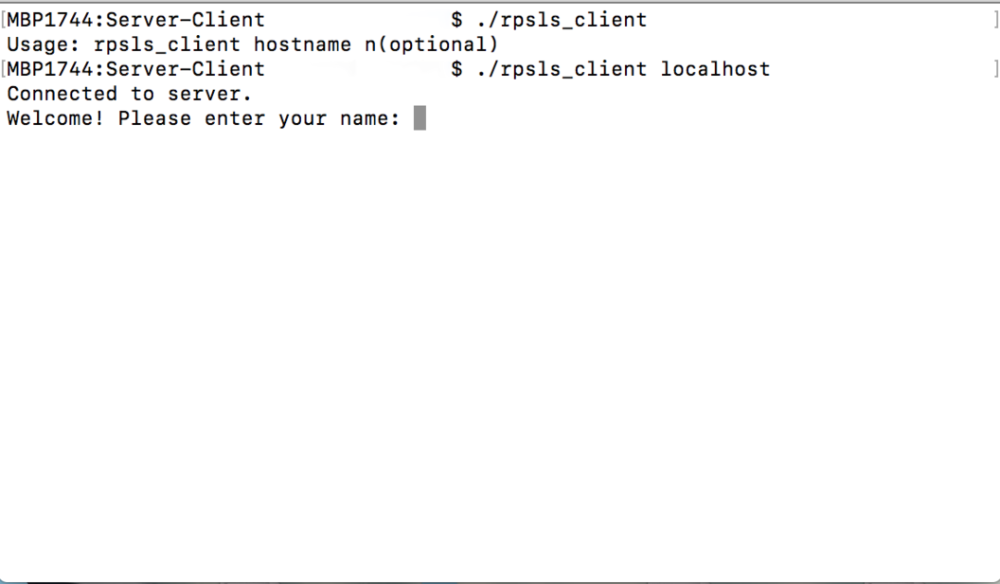
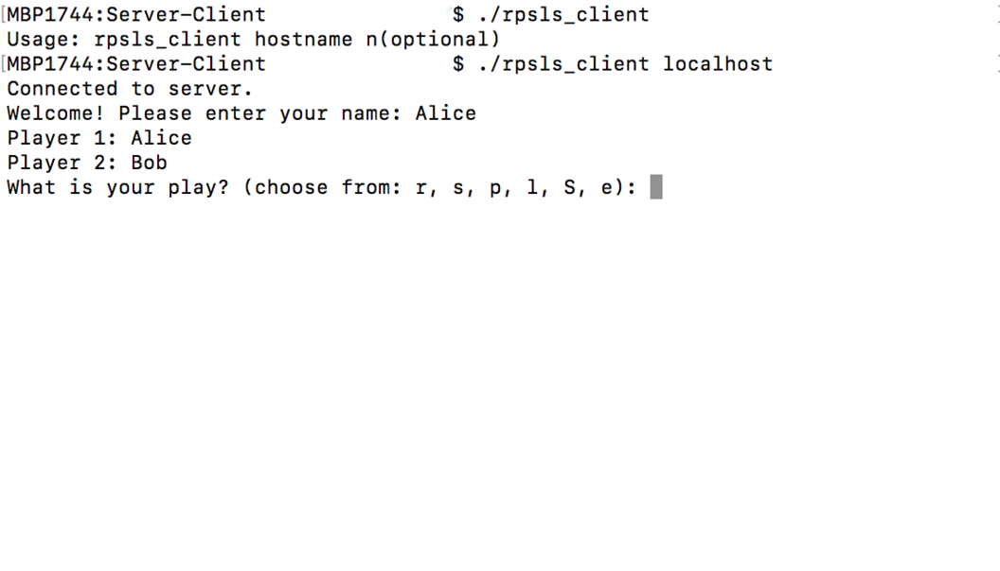
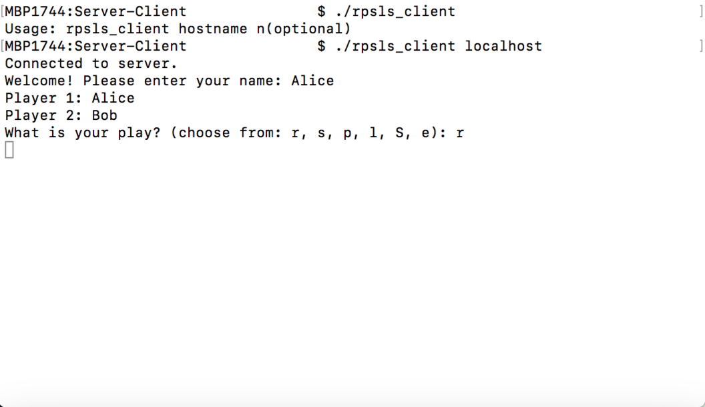
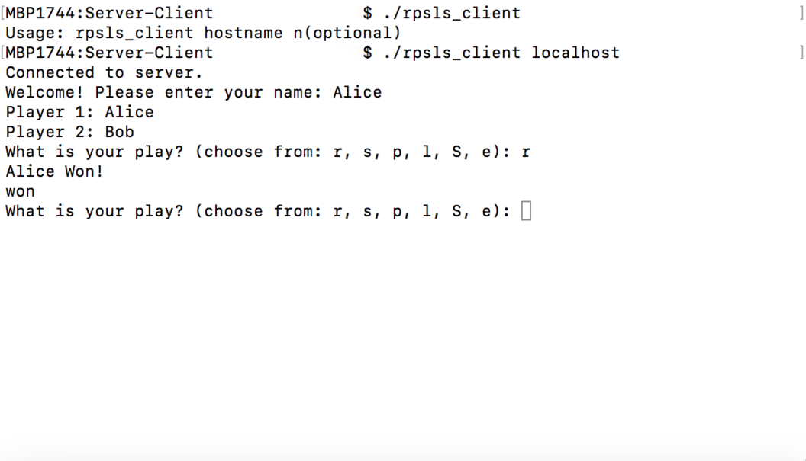
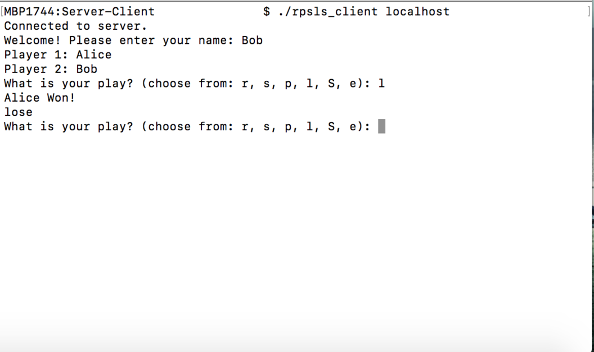
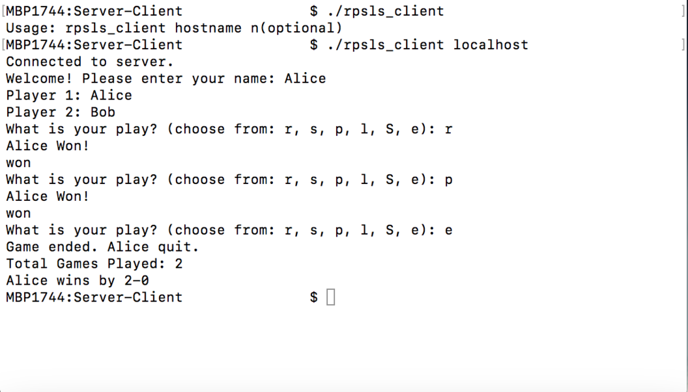
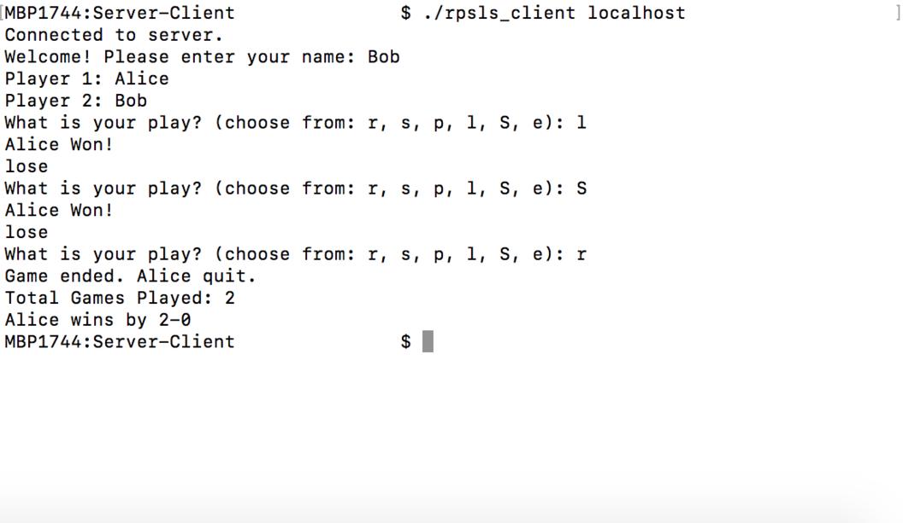

# Overview
A server-client version of the rock-paper-scissor-lizard-splock (rpsls) game created in C using system calls. The game server, which is implemented in rpsls_server.c, will moderate one or more games of rpsls between two clients, which is implemented in rpsls_client.c. Three
processes will be running when a game is being played, the server and two instances of the client. First, the server instance is run and it waits for clients to connect by looking for connections on port 60000. Next, the two client instances are run, trying to connect to the server using the _server IP Address_ given. Once the connection is intialized, the clients can only send one of 6 messages (for each game) to the server: **r** for rock, **p** for paper, **s** for scissors, **l** for lizard, **S** for Spock, or **e** for end. As one (or both) player(s) end the game, the game statistics are displayed on both the players screen and the processes terminate.

# Rules

# Tutorial:
## Step 1
Compile the C source codes using the make file then, run the _rpsls_server_ excutable file.
As shown below:

## Setp 2
Run the _rpsls_client_ excutable file with the servers _IP Address_ as command line argument and wait for it to connect to the server. Once connected, it will ask for you to enter your name, at which point you should do so to continue.
As shown below:

## Setp 3
- Once you enter your name, the process holds until the other player is connected. As both players connect, the server sends the players detail to both the clients (i.e. players) and the first round begins.
As shown below:

- The client process, after submitting the first play, holds for the other player to submit their first play to the server.
As shown below:

- Next, as the server gets both the players play, it determines who won the first round and sends the details to the clients.
The client side then outputs a _win_ or _lose_ status to the respective client, as well as the winners name.
As shown below:

  
  

## Step 4
Finally, when one of the player quits the game (by entering **e**), the server sends the game statistics to both the clients and terminates the connection.
As shown below:

  
  

# Detailed summary:
## Server
The server moderates zero or more games between two players (client processes). The server will create two stream sockets with port number 60000 and waits for requests to play a game from two clients. Once a connection has been made with two clients, the server sends a message to both players informing each of the two players names and asking for their hand gestures (one of rock, paper, scissors, lizard or Spock) for a game of rpsls; it then waits for each to send their gesture. Once both players send their gesture, the server decides who wins and informs both players who won that round and asks for their gestures for the next round. The game is repeated until one (or both) players wishes to stop playing. When no more games are to be played the server sends, to both players, the game statistics and then the server closes both sockets, which ends the game and the process terminates.
### Command Line Argument:
The server will optionally accept a command line argument that will act as a shift for the port numbers to use. 
- If _no_ command line argument is given, it will try to use port _60000_. 
- If a command line argument is given, it will be an integer (call it n) and the sever will try to use port _60000 + n_.

## Client
A client creates a socket and tries to connect to the server. When a connection is made with the server, the client sends the player's name to the server (it will ask for players name at some point when it first runs). The client then asks the player for a gesture to begin the game and queries the user (to input a gesture from stdin). It then sends the gesture to the server and this is repeated until either the player wishes to stop playing (or the other player wishes to stop playing). When the server sends the game statistics, the client displays the information to the user (on stdout), closes its socket and terminates.
### Comand Line Arguments:
The client will use one or two command line arguments. 
- The **first** argument (not including the program name) will be the _IP address of the server_. 
- The **second**, _optional_, argument will be the same number _n_ that was used when running the server (if one was provided) to specify which port to try.
